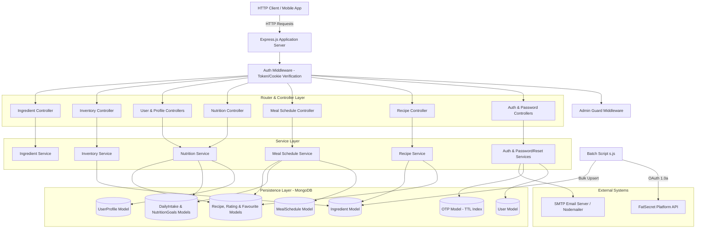

# Cookify Backend System Architecture Documentation

## 1. Executive System Overview

Cookify Backend is a RESTful application service built with Node.js, Express, and MongoDB (via Mongoose). The system powers an intelligent cooking, nutrition tracking, inventory management, and meal scheduling ecosystem.

### Primary Responsibilities
- **User & Identity Management:** Secure authentication (JWT access/refresh tokens), role-based authorization (User vs. Admin), profile management, and password recovery via email OTP.
- **Ingredient & Recipe Catalog:** Master database of ingredients with detailed nutritional breakdowns (calories, macros, micronutrients per 100g) and user/admin recipe management.
- **Automated Nutrition Computation:** Automatic aggregation of nutritional profiles per 100g for recipes based on ingredient constituents.
- **Smart Nutrition Tracking & Personalization:** Automatic calculation of Basal Metabolic Rate (BMR) and Total Daily Energy Expenditure (TDEE) using the Mifflin-St Jeor equation to generate calorie, macronutrient, and micronutrient goals. Real-time daily intake logging and target tracking.
- **Grocery Inventory Tracking:** User-level grocery inventory linked to master ingredients.
- **Meal Scheduling & Synchronized Logging:** Calendar-based meal scheduling across defined slots (`breakfast`, `snack1`, `lunch`, `snack2`, `dinner`). Completing scheduled meals automatically logs entries and nutrition snapshots into the user's daily intake.

---

## 2. Core Architectural Patterns & Technology Stack

### Architectural Style
- **Monolithic REST API Layer:** Express.js router layer backed by a modular Controller-Service-Model architecture.
- **Stateless Authentication with Dual Token Delivery:** JWT-based access and refresh tokens handled via both HTTP `Authorization: Bearer` headers and HTTP-only cookies.
- **Precomputed & Snapshot Aggregation:** Nutrition values are auto-computed at the recipe level when ingredients change and snapshot-embedded into daily intake logs to ensure fast read performance and immutability against master catalog changes.

### Core Technologies
- **Runtime:** Node.js (CommonJS module system)
- **Web Framework:** Express.js (`v5.2.1`)
- **Database & ORM:** MongoDB via Mongoose (`v9.2.1`)
- **Security & Auth:** `bcryptjs` (password hashing), `jsonwebtoken` (JWT issuance/verification), `cookie-parser` (HTTP-only cookie retrieval)
- **Communication & External APIs:** `nodemailer` (SMTP OTP dispatch), `axios` & `oauth-1.0a` (FatSecret OAuth REST API client)
- **Utilities:** `slugify` (URL-friendly identifiers), `dotenv` (environment configuration management)

---

## 3. High-Level System Topology

The following diagram illustrates the runtime deployment topology and request flow across system layers:



---

## 4. Layered Module Boundaries & Directory Structure

```
cookify-backend/
├── app.js                      # Application entrypoint & HTTP server setup
├── config/
│   └── db.js                   # MongoDB connection logic via Mongoose
├── controller/                 # HTTP Request/Response handlers
│   ├── auth.controller.js
│   ├── favourite.controller.js
│   ├── ingredient.controller.js
│   ├── inventory.controller.js
│   ├── mealSchedule.controller.js
│   ├── nutrition.controller.js
│   ├── passwordReset.controller.js
│   ├── profile.controller.js
│   ├── recipe.controller.js
│   └── user.controller.js
├── middleware/
│   ├── admin.middleware.js     # Admin role verification guard
│   └── auth.middleware.js      # JWT token authentication & automatic refresh
├── models/                     # Mongoose Schema definitions
│   ├── DailyIntake.model.js
│   ├── Favourite.model.js
│   ├── Ingredient.model.js
│   ├── Inventory.model.js
│   ├── MealSchedule.model.js
│   ├── NutritionGoals.model.js
│   ├── OTP.model.js
│   ├── Rating.model.js
│   ├── Recipe.model.js
│   ├── User.model.js
│   └── UserProfile.model.js
├── router/                     # Express route definitions
│   ├── auth.routes.js
│   ├── calorieTrack.route.js   # Legacy alias routes for nutrition goals/intake
│   ├── favourite.routes.js
│   ├── ingredient.routes.js
│   ├── inventory.routes.js
│   ├── mealSchedule.routes.js
│   ├── nutrition.routes.js
│   ├── profile.routes.js
│   ├── recipe.routes.js
│   └── user.routes.js
├── service/                    # Core business logic & database interaction
│   ├── auth.service.js
│   ├── ingredient.service.js
│   ├── inventory.service.js
│   ├── mealSchedule.service.js
│   ├── nutrition.service.js
│   ├── passwordReset.service.js
│   └── recipe.service.js
├── validation/                 # Request payload validation middleware
│   ├── auth.validation.js
│   ├── ingredient.validation.js
│   ├── inventory.validation.js
│   ├── passwordReset.validation.js
│   ├── profile.validation.js
│   ├── recipe.validation.js
│   └── user.validation.js
└── s.js                        # Data ingestion utility (FatSecret API client)
```

### Communication Flow Between Layers
1. **Route Layer:** Defines URI paths, HTTP methods, attaches request validation middleware, and assigns controllers.
2. **Validation Layer:** Intercepts request payloads/params, enforcing type, format, and presence constraints prior to controller invocation.
3. **Controller Layer:** Extracts parameters, calls service layer functions, handles standard status codes (200, 201, 400, 403, 404, 409, 500), and formats uniform JSON responses (`{ success: boolean, data?: any, message?: string }`).
4. **Service Layer:** Encapsulates core business rules (e.g., Mifflin-St Jeor TDEE computation, recipe nutrition refresh, meal scheduling sync to daily intake).
5. **Model Layer:** Manages persistence schema validations, default values, subdocuments, and database queries.

---

## 5. Data Models & Persistence Architecture

MongoDB is the single source of truth. Below are the key domain entities and their schema structures:

### Key Database Schemas & Relations

```mermaid
erDiagram
    USER ||--o| USER_PROFILE : 